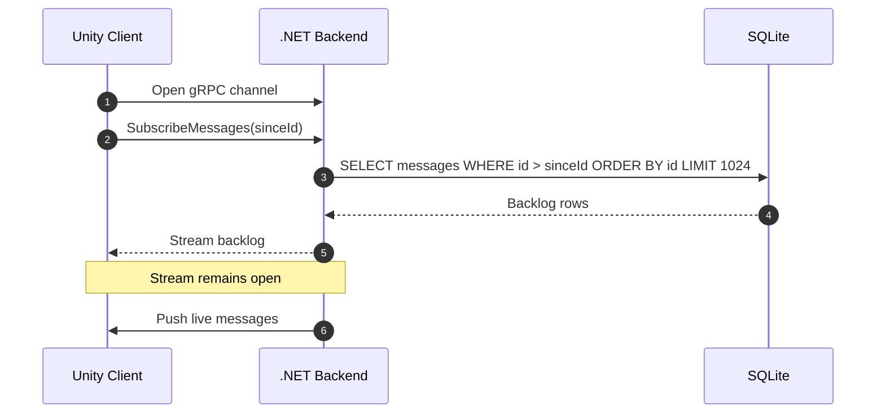
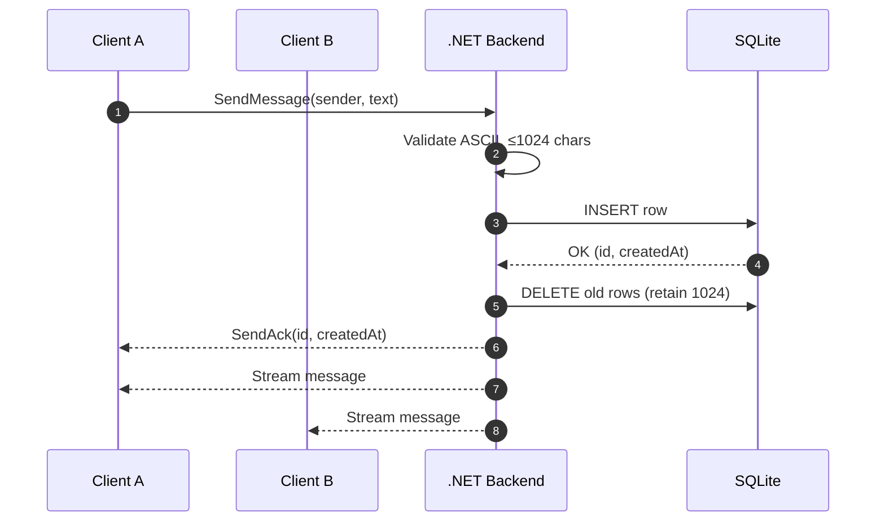
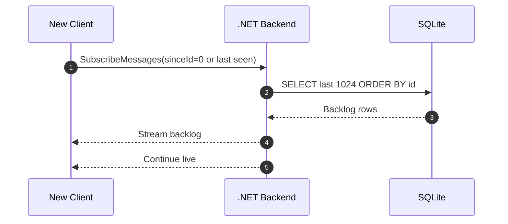

# Unity gRPC Chat
Minimal chat app with Unity 6 client and .NET backend over gRPC + Protobuf + SQLite.

## Quick Start

1. **Backend**
   See [Backend/README.md](Backend/README.md) for setup and scripts.

2. **Unity Client**
   - Open repo in Unity 6.
   - Install [NuGetForUnity](https://github.com/GlitchEnzo/NuGetForUnity/releases/tag/v4.5.0).
   - Use it to add:
     - `Grpc.Net.Client`
     - `Grpc.Net.Client.Web`
     - `Google.Protobuf`
     - `Grpc.Core.Api`
   - Enter Play Mode to test chat between clients.

## Functional Requirements
- Enter display name before sending messages.
- Type messages via keyboard (ASCII only, max 1024 chars).
- Shared history shows last 1024 messages with sender and timestamp.
- Messages reach all clients within 15s.
- Late joiners get recent history.

## Technical Requirements
- Unity required gRPC-Web over HTTP/1.1, Protobuf payloads.
- Backend persists to SQLite, keeps last 1024 rows.
- No auth, encryption, or scaling beyond 2 clients (local dev only).
- NUnit automated tests included.

## Architecture
- .NET 8 minimal gRPC server, SQLite storage.
- Unity client consumes gRPC stream, appends to scrollable UI.
- Clients dedupe & order by `id`.

### Message Flow

#### Connect & Subscribe

#### Send & Broadcast

#### Late Joiner

